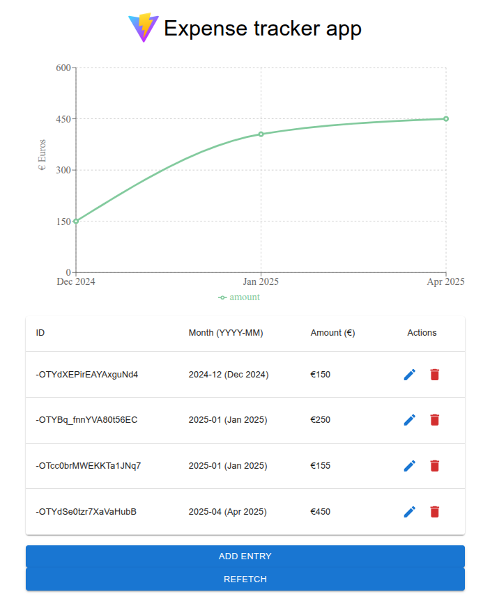

# Simple expense tracking app 

- Written in React + Vite, using Firebase realtime database

- For the app to work, you need to insert your own Firebase DB config in `/src/config.js` (by default the file will be missing; you need to create it and fill out an object called ENV with the data whose references will be missing in the `/src/logic/hooks.js` file)

## Features

How this app works:

- Insert expenses in a simple format, i.e. insert month and amount spent

- If you enter 2 expenses for the same month, the data is added together for the chart

- Use "Add entry" to save additional expenses

- Use the table to view, edit or delete individual entries

## Demo

